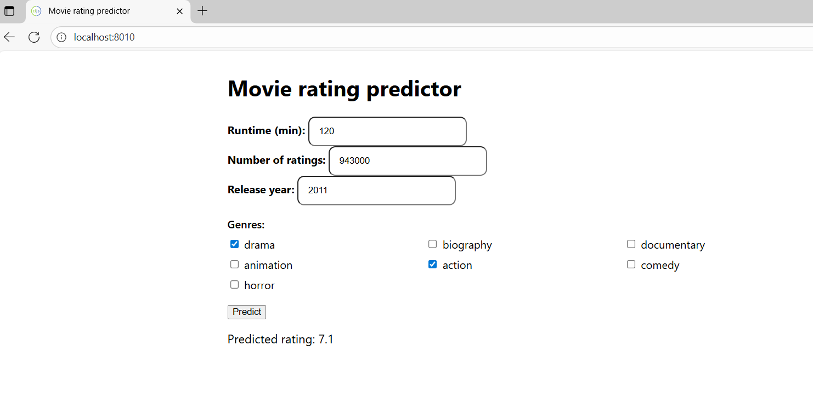

# Movie Rating Predictor - Frontend (ClojureScript)

A simple browser UI for predicting a movie's IMDB rating.  
Users enter **runtime**, **number of ratings**, **release year**, and select **genres**; the app sends a JSON payload to the backend `POST /api/predict` and shows the predicted rating (rounded to one decimal).

## Tech

- **ClojureScript** 
- **shadow-cljs** (build tool)
- **HTML/CSS** 
- Talks to the backend at: `http://localhost:3000/api/predict` (configurable)

To run the frontend locally, make sure you have the following installed:

- **Node.js**
- **npm** (comes with Node.js)
- **Java JDK**

# Quick Start - Backend then Frontend

Start the **backend** first, then run the **frontend** (UI).

## Frontend

```bash
# In a second terminal
git clone <https://github.com/anndjella/IMDB-frontend>
cd <IMDB-frontend>

npm install
npx shadow-cljs watch app
```
The dev server will start at **http://localhost:8010/**.
    Open that URL in your browser to use the UI.

## Form Input Constraints

When entering values, the UI enforces the following ranges:

-   **Runtime (minutes):** must be between 20 and 400 (e.g. 95).
-   **Number of ratings:** must be between 1 and 4,000,000
    (e.g. 15,000).
-   **Release year:** must be between 1900 and 2030 (e.g. 2015).

All fields are **required** and only accept digits (`pattern="\d+"`,
`inputmode="numeric"`).

## Error Handling

-   If the backend is **not** running or unreachable, the browser
    console/network panel will show:\
    `TypeError: Failed to fetch`\
    Make sure the backend is up and CORS is configured (if needed) for
    requests from `http://localhost:8010`.


## Final Result

In the end, the app should look like this:
